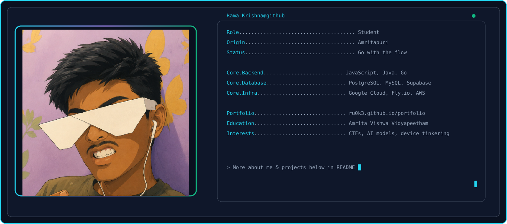
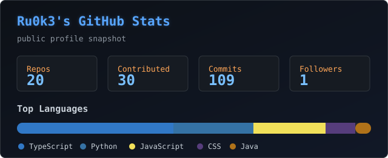

<a href="https://github.com/Ru0k3/Ru0k3">
  <picture>
    <source media="(prefers-color-scheme: dark)" srcset="dark_mode.svg" />
    <source media="(prefers-color-scheme: light)" srcset="light_mode.svg" />
    
  </picture>
</a>

## Github Statistics :bar_chart:

  

## Contact :

  
  
  
  

