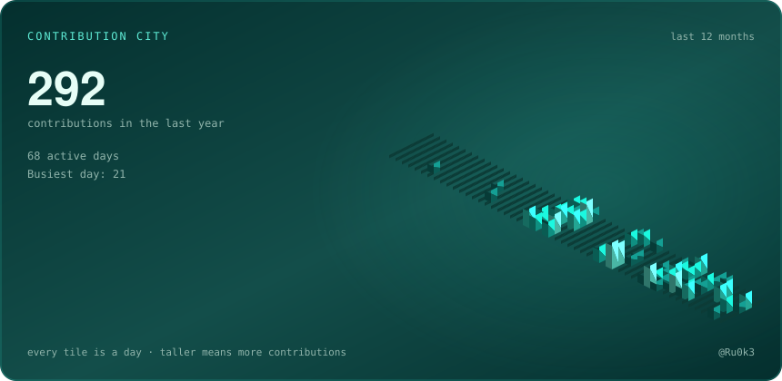
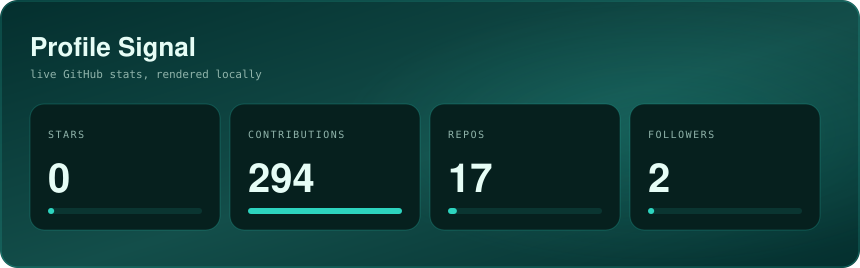
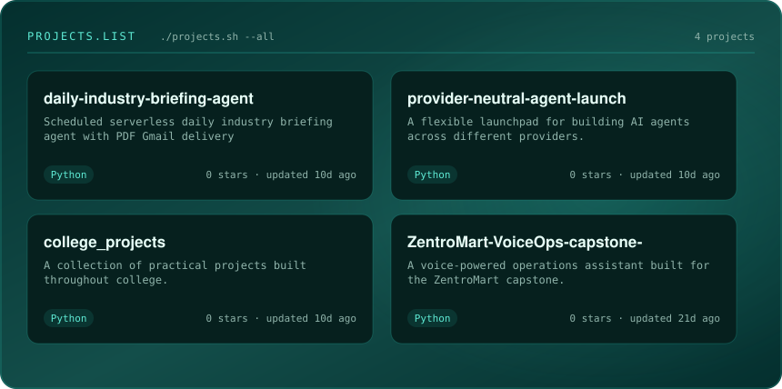

  

## The city I built this year

  

Every building is a day; taller means more contributions.

## Population

  

## Landmarks

  

## Visit

  

<a href="https://github.com/Ru0k3">GitHub</a> · <a href="https://ru0k3.github.io/portfolio/">Portfolio</a> · <a href="https://www.linkedin.com/in/venkata-rama-krishna-dulam-302637378/">LinkedIn</a> · <a href="https://www.instagram.com/r._krishna_21/">Instagram</a> · <a href="mailto:ramakrishnadulam10@gmail.com">Email</a>

Krishna · profile panels rendered from live GitHub data

